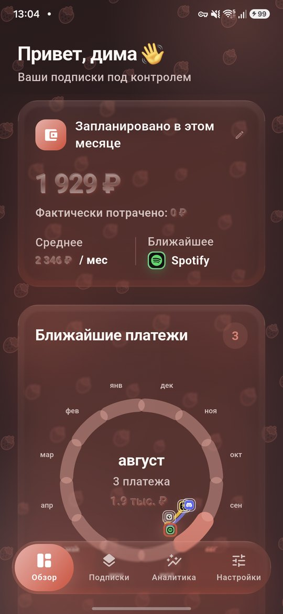
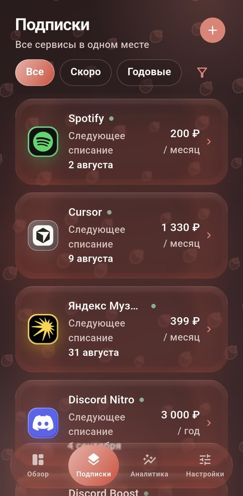
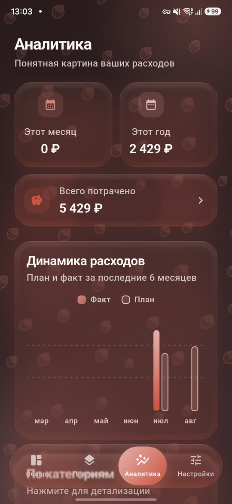
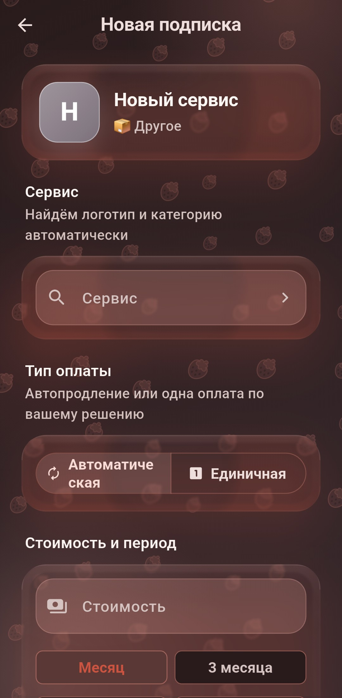
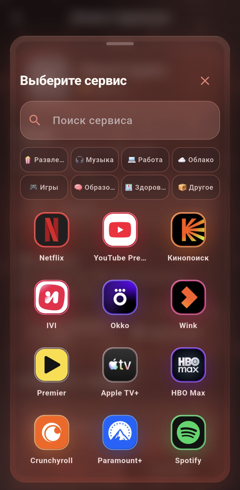
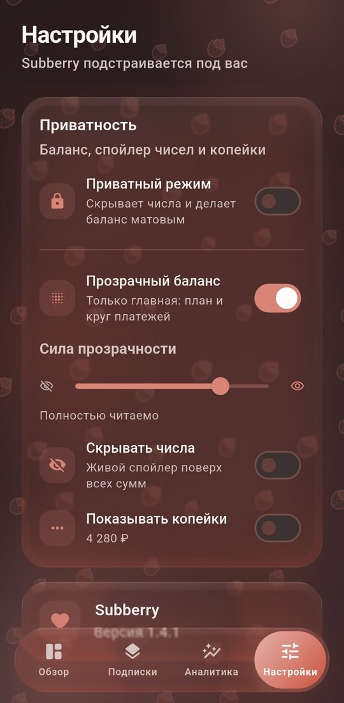
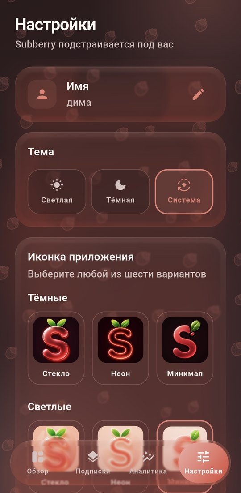
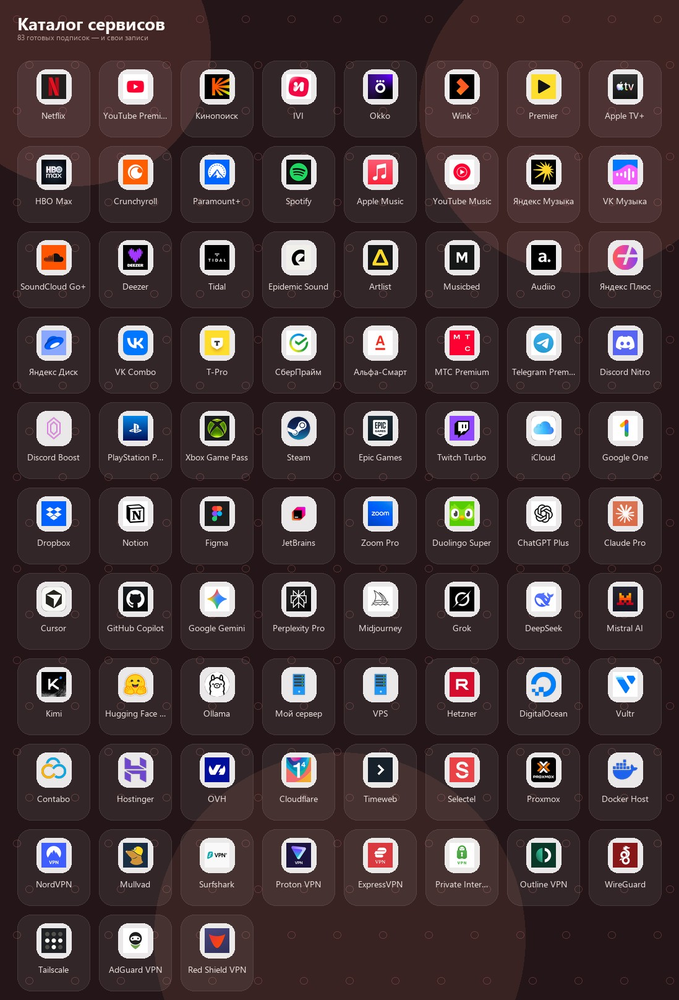

  

<h1 align="center">Subberry</h1>

  <strong>Ваши подписки под контролем</strong>

  Красивый трекер подписок, который помогает видеть ближайшие списания, 
  понимать расходы и держать баланс приватным — без лишнего шума.

  
  &nbsp;
  
  &nbsp;
  

---

## Зачем Subberry

Подписки легко потерять из виду: Spotify сегодня, Cursor завтра, Discord раз в год.
**Subberry** собирает их в одном месте и показывает понятную картину:

- сколько запланировано в этом месяце
- что спишется в ближайшие дни
- куда уходят деньги за год

Всё на вашем устройстве. Без аккаунта, без облака, без рекламы.

---

## Возможности

### Обзор
Главный экран с живым календарём платежей. Сразу видно план месяца, факт, среднее и ближайший сервис.

  

### Подписки
Каталог знакомых сервисов и свои записи. Фильтры по сроку и периоду, статусы, даты следующих списаний.

  

### Новая подписка
Выберите сервис из сетки логотипов — название, категория и иконка подставятся сами. Или добавьте свой сервис.

  
  &nbsp;
  

### Аналитика
Месяц, год и общий итог. Динамика плана и факта, структура по категориям, понятные подсказки.

  

### Приватность
Цифры можно сделать стеклянными, спрятать спойлером или включить приватный режим одним жестом.

  

### Внешний вид
Светлая и тёмная тема, акцентные цвета, эмодзи на фоне, шесть иконок приложения и эффект стекла — от матового до Liquid Glass.

  

---

## Какие подписки поддерживаются

Более 80 готовых сервисов с логотипами: стриминг, музыка, работа, AI, облака, игры, VPN и хостинг. Свои записи тоже можно добавить.

  

---

## Что внутри продукта

| | |
|---|---|
| **Напоминания** | Уведомления о списаниях с настраиваемым запасом дней |
| **Приватность** | Прозрачный баланс, спойлер сумм, приватный режим |
| **Персонализация** | Тема, цвет, фон, иконка, сила стекла, виброотдача |
| **Календарь** | Круг ближайших платежей и годовой вид |
| **Каталог** | Готовые сервисы с логотипами и свои подписки |

---

## Для кого

- если подписок больше трёх и хочется контроля
- если важно видеть «сколько уйдёт в этом месяце» до зарплаты
- если не хочется светить суммы на экране в метро

---

  <em>Subberry подстраивается под вас</em>

